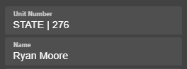

### **Introduction**

LEOs in **Denali State Roleplay (DSRP)** must follow these rules to ensure fairness, respect, and proper roleplay.

:::note
Ensure you are familiar with all server guidelines before beginning your role.
:::

### **Requirements**

1. Understand and adhere to **server rules**.

:::note
Review the current server rules regularly to stay updated.
:::

### **General Rules**

1. Use appropriate uniforms and gear.
2. Any department vehicle can be used, but **do not activate visor lights if the vehicle is equipped with a light bar**.
3. Approved weapons:
   - Pistol
   - Combat Pistol
   - Stun Gun
   - Bean Bag Shotgun
   - Carbine Rifle
4. No need to process suspects at the station unless desired for roleplay.
5. License plates must follow the format: **LEO 276** (with two spaces between the letters and numbers).

:::warning
Unauthorized use of non-approved equipment or weapons will result in disciplinary actions.
:::

### **Conduct**

1. Avoid exploiting, metagaming, or powergaming.
2. Follow the server's **respect rule**.
3. Escalate situations **only when necessary**.

:::note
Always attempt to resolve conflicts through clear communication before resorting to escalation.
:::

### **Radio Use**

1. Use **10-codes** and maintain clear communication.
2. Avoid unnecessary chatter.

:::warning
Incorrect use of 10-codes can lead to miscommunication during critical incidents.
:::

### **Use of Force Chart**

LEOs should use **proportional force** based on suspect behavior, always aiming to stay **one step above** the threat level to maintain control and ensure safety.

| **Suspect Behavior**                                                 | **LEO Response**                                      | **Examples / Notes**                                      |
| -------------------------------------------------------------------- | ----------------------------------------------------- | --------------------------------------------------------- |
| **Compliant**                                                        | Verbal Commands                                       | Clear instructions, no force needed                       |
| **Passive Resistance** (e.g., ignoring commands, walking away)  | Soft Hands / Physical Guidance                        | Escort by arm, basic control holds                        |
| **Active Resistance** (e.g., running, struggling)               | Taser / OC Spray                                      | Use if verbal commands fail or suspect resists physically |
| **Aggressive / Assaultive** (e.g., punching, kicking)           | Taser / Baton / Less-Lethal Shotgun                   | Only if actively violent, avoid unnecessary escalation    |
| **Threat with Weapon (Non-Firearm)**                                 | Firearm Drawn (Do Not Fire Unless Threat Is Imminent) | Maintain distance, give loud commands                     |
| **Lethal Threat** (e.g., firearm aimed, vehicle used as weapon) | Lethal Force Authorized                               | Must be a direct threat to life of officer or others      |

### **Sonoran CAD – Unit Number Format**

When setting your **Unit Number** in Sonoran CAD, use the following format based on your department. This helps ensure proper unit identification by dispatch and other officers.

**Required Format:**  
`AREA | UNITNUMBER`  
*(Set this in the "Unit Number" field in CAD, as shown below)*

#### Approved Formats by Department:

- `SANDY | ###` – For **Sandy Shores Police Department (SSPD)**
- `METRO | ###` – For **Los Santos Police Department (LSPD)**
- `PALETO | ###` – For **Paleto Bay Police Department (PBPD)**
- `STATE | ###` – For **San Andreas State Troopers (SAST)**

> **Example:** `STATE | 276`  
> This would represent a State Trooper with unit number 276.

Please make sure you are using the correct format before going on duty.

#### **Guidelines:**

- **De-escalate** whenever possible using voice and presence.
- Always give **clear warnings** before using force.
- Do not escalate beyond what is **reasonable and necessary**.
- Lethal force should always be a **last resort**.

:::note
Always assess the situation carefully before deciding on the appropriate level of force.
:::

### **Disciplinary Actions**

1. Failure to follow rules will result in **LEO tag removal**.
2. You may reapply only after **one month** if tags are removed.
3. In severe cases, you may **not be allowed to regain your tag** if staff determines that you should not have it based on the reason it was removed.

:::warning
Repeated violations or severe misconduct may result in permanent disqualification from LEO status.
:::

### **Acknowledgment**

All LEOs must agree to these rules before starting their role in **Denali State Roleplay (DSRP)**.

:::note
By continuing, you acknowledge that you have read and understand these SOPs.
:::
